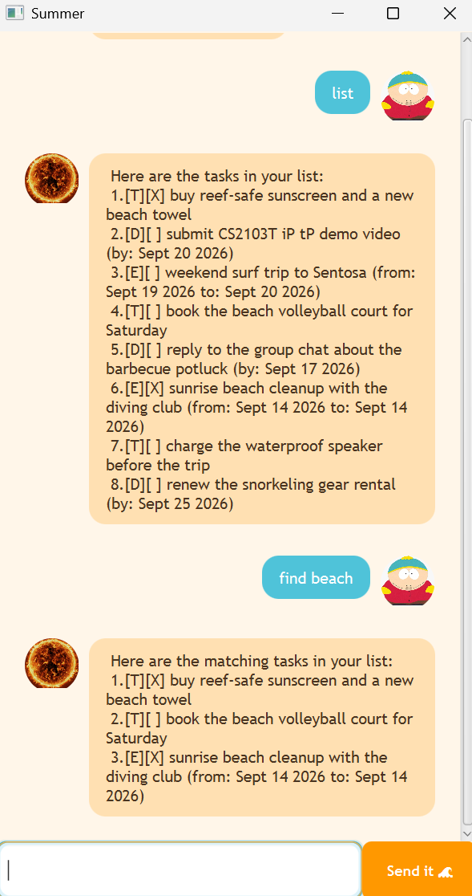

# Summer User Guide



Summer is a laid-back, surfer-vibe task manager you talk to in plain
commands. Type what you need to do, and Summer keeps it on the board.
It runs as a desktop chat window and saves your tasks between sessions,
so you can close it and pick up right where you left off.

## Quick start

1. Ensure you have Java 25 installed.
2. Download the latest `summer.jar` from the releases page.
3. Run it from a terminal with:
   ```
   java -jar summer.jar
   ```
4. Type a command into the input box and press Enter (or click **Send it 🌊**).

## Features

### Adding a todo: `todo`

Adds a task with no date attached, for things without a deadline.

Format: `todo DESCRIPTION`

Example: `todo buy reef-safe sunscreen`

```
 Righto, that's on the board:
   [T][ ] buy reef-safe sunscreen
 1 tasks lined up now.
```

### Adding a deadline: `deadline`

Adds a task that needs to be done by a specific date.

Format: `deadline DESCRIPTION /by YYYY-MM-DD`

Example: `deadline submit iP tP demo video /by 2026-09-20`

```
 Righto, that's on the board:
   [D][ ] submit iP tP demo video (by: Sept 20 2026)
 2 tasks lined up now.
```

### Adding an event: `event`

Adds a task that spans a start and end date.

Format: `event DESCRIPTION /from YYYY-MM-DD /to YYYY-MM-DD`

Example: `event weekend surf trip to Sentosa /from 2026-09-19 /to 2026-09-20`

```
 Righto, that's on the board:
   [E][ ] weekend surf trip to Sentosa (from: Sept 19 2026 to: Sept 20 2026)
 3 tasks lined up now.
```

### Listing all tasks: `list`

Shows every task currently on the board, numbered in the order you added them.

Example: `list`

### Finding tasks: `find`

Lists every task whose description contains the given keyword. The search
is case-sensitive and matches anywhere in the description.

Format: `find KEYWORD`

Example: `find surf`

```
 Here are the matching tasks in your list:
 1.[E][ ] weekend surf trip to Sentosa (from: Sept 19 2026 to: Sept 20 2026)
```

### Viewing tasks on a date: `on`

Lists every deadline due on, or event running through, the given date.
Todos never show up here since they have no date.

Format: `on YYYY-MM-DD`

Example: `on 2026-09-20`

### Sorting tasks: `sort`

Sorts the whole list by date, earliest first. Deadlines are ordered by their
due date and events by their start date; todos have no date, so they're
listed last. The new order is saved.

Example: `sort`

```
 Here are the tasks in your list, sorted:
 1.[E][ ] weekend surf trip to Sentosa (from: Sept 19 2026 to: Sept 20 2026)
 2.[D][ ] submit iP tP demo video (by: Sept 20 2026)
 3.[T][ ] buy reef-safe sunscreen
```

### Marking a task as done: `mark`

Marks the task at the given number as completed.

Format: `mark INDEX`

Example: `mark 1` marks the first task in the list as done.

### Marking a task as not done: `unmark`

Marks the task at the given number as not yet completed.

Format: `unmark INDEX`

Example: `unmark 1` marks the first task in the list as not done.

### Deleting a task: `delete`

Removes the task at the given number from the list.

Format: `delete INDEX`

Example: `delete 2` removes the second task in the list.

### Exiting Summer: `bye`

Says goodbye and closes the window shortly after.

Example: `bye`

## Saving the data

Summer saves your tasks automatically to disk after every command that
changes the list, no manual save needed. Data is loaded back the next time
you start Summer.

## Command summary

| Action | Format | Example |
|---|---|---|
| Add a todo | `todo DESCRIPTION` | `todo buy sunscreen` |
| Add a deadline | `deadline DESCRIPTION /by YYYY-MM-DD` | `deadline demo video /by 2026-09-20` |
| Add an event | `event DESCRIPTION /from YYYY-MM-DD /to YYYY-MM-DD` | `event surf trip /from 2026-09-19 /to 2026-09-20` |
| List all tasks | `list` | `list` |
| Find tasks | `find KEYWORD` | `find surf` |
| View tasks on a date | `on YYYY-MM-DD` | `on 2026-09-20` |
| Sort tasks by date | `sort` | `sort` |
| Mark a task done | `mark INDEX` | `mark 1` |
| Mark a task not done | `unmark INDEX` | `unmark 1` |
| Delete a task | `delete INDEX` | `delete 2` |
| Exit | `bye` | `bye` |
